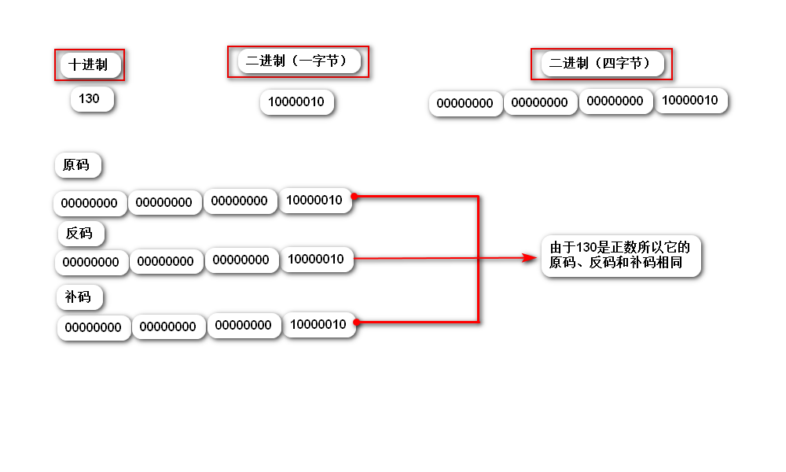
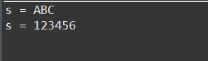

[一： 关于byte b = 130赋值语句是否正确](#fuzhi)

[二：StringBuilder和StringBuffer、StringBuilder和String的区别](#String)


<h3 id="fuzhi>赋值问题</h3>
```byte b = 130;```

> 上面的赋值语句是否存在问题？若存在问题，应该如何更改？更改后赋值的结果是多少？

> 解析：上面的赋值语句存在问题，因为byte类型的取值范围是-128 - 127之间，而130已经超出了byte的取值范围，因此存在问题。
> 更改方式：强制转换

```byte b = (byte)130```

> 最终的结果为：-126

> 结果分析：
- 首先：要了解计算机是如何进行计算的？
- - 计算机采用补码的方式进行计算
- 其次：要想根据计算方式获取到结果，前提是要知道数据的二进制的表示形式
- - 获取数据的二进制的表示形式：
- 再次：做截取操作，截取成byte
- 最后：根据已知的补码求原码
- 

<h3 id="String">StringBuilder和StringBuffer、StringBuilder和String的区别</h3

- <font color="red" size="5">StringBuilder和StringBuffer</font>
- - StringBuilder线程不安全，效率高，建议使用
- - StringBuffer线程安全，效率低，不建议使用
- <font color="red" size="6">StringBuilder和String的区别</font>
- - String是不可变字符串，StringBuilder是可变字符串.String之所以是不可变字符串是因为在String的底层代码中，规定了String类的成员属性字符数组为private final char values[]，是由final关键字修饰的，因此意味着，string一旦被赋值便不能在被改变。但是会产生如下疑问:

```
public class Test {
	public static void main(String[] args) {
		String s = "ABC";
		System.out.println("s = " + s);
		
		s = "123456";
		System.out.println("s = " + s);
	}
}
```
以上代码的运行结果如下：

