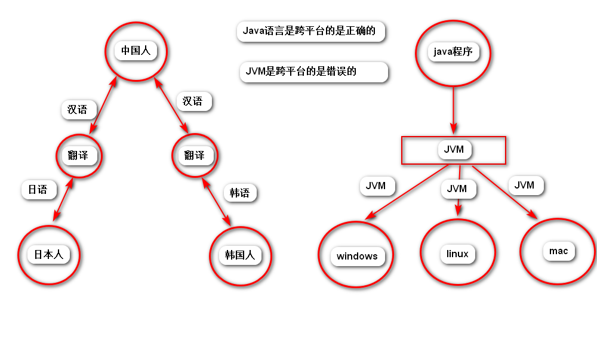

## （一）：Java语言概述
### 一：Java语言平台版本
* **J2SE（Java 2 Platform Standard Edition）标准版**
* * 是为了开发普通桌面和商务应用程序提供的解决方案。
* * 该技术是其他两者的基础，可以完成一些桌面应用程序的开发。
* **J2ME（Java 2 Platform Micro Edition）小型版**
* * 是为了开发电子消费产品和嵌入式设备提供的解决方案。
* **J2EE（Java 2 Platform Enterprise Edition）企业版**
* * 是为开发企业环境下的应用程序提供的一套解决方案。
* * 该技术体系中包含的技术如Servlet，JSP等，主要针对于Web应用程序开发。

### 二：Java语言的特点
* 简单
* 解释
* 面向对象
* 高性能
* 分布式处理
* 多线程
* 健壮性
* 动态
* 结构中立
* 安全性
* **开源**
* **跨平台《操作系统》**

* 

### 三：JRE、JDK和JVM
* **JRE（Java Runtime Environment）Java运行环境**
* * 包括Java虚拟机（JVM Java Virtual Machine）和Java所需的核心类库等，如果想要运行一个开发好的Java程序，计算机只需要安装JRE即可。
* **JDK（Java Development Kit）Java开发工具包**
* * JDK提供给Java开发人员使用的，其中包含了Java的开发工具，也包含了JRE，所以安装了JDK，就无需再单独安装JRE了。其中的开发工具：编译工具（javac.exe）打包工具（jar.exe）.
* **JDK/JRE/JVM三者的关系以及作用：**
* * **作用**
* * * JVM：保证Java语言跨平台
* * * JRE：Java程序的运行环境
* * * JDK：Java程序的开发环境 [官网](https://www.oracle.com)
* * **关系**
* * * JDK=JRE+工具
* * * JRE=JVM+类库

### 四：编程过程中的常见错误
* 扩展名被隐藏
* 文件名称与类名称相同
* Java语言严格区分大小写
* 见到非法字符\65307,中文问题。标点符号必须是英文状态下的。
* 括号成对出现

### 五：path和classpath的区别
* path环境变量里面记录的是可执行性文件，如.exe文件，对可执行文件现在当前路径去找，如果没有找到就去path环境变量中配置的的路径去找。
* classpath环境变量里记录的是java类的运行文件所在的目录。

### 六：Java程序的开发执行流程
* 编写java源程序（.java）
* 通过javac命令编译生成.class文件
* 通过java命令运行.class文件

## （二）：Java基础语法
### 一：关键字
* 关键字概述
* * 被Java语言赋予特定含义的单词
* 关键字特点
* * 组成关键字的字母全部小写
* 关键字注意事项
* * goto和const作为保留子存在，目前并不使用
